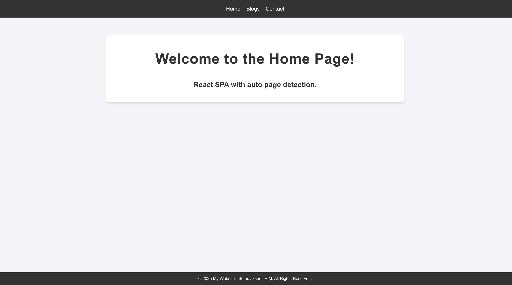

# Getting Started with Create React App

GitHubFinder - https://react-sethu-example-spa.netlify.app/

## Available Scripts

To run this Project:

### `npm install` to install the node_modules

### `npm start` to run this project.

Runs the app in the development mode.\
Open [http://localhost:3000](http://localhost:3000) to view it in your browser.

To test this Project:

### `npm test`

Launches the test runner in the interactive watch mode.\
See the section about [running tests](https://facebook.github.io/create-react-app/docs/running-tests) for more information.

To build this Project:
### `npm run build`

### Deployment

[Using Netlify..!!](https://app.netlify.com/sites/react-sethu-example-spa/overview)

# Description - [react-sethu-example-spa](https://react-sethu-example-spa.netlify.app/)

- **App Overview:**
  - A simple web app with a clean home page design.
  - Uses **React Router** for smooth and efficient navigation between pages.
  
- **Navigation Structure:**
  - **Home**: The landing page and default view.
  - **Blogs**: A section containing blog posts, including details on auto page detection for transitions.
  - **Contact**: A page for user inquiries or contact information.

- **Features:**
  - React Router integration for seamless page transitions.
  - Automatic page detection for transitions on the **Blogs** page, optimizing the user experience.
  
- **Technologies Used:**
  - Built with **React**.
  - Utilizes **React Router** for page navigation.

- Sethulakshmi P M.